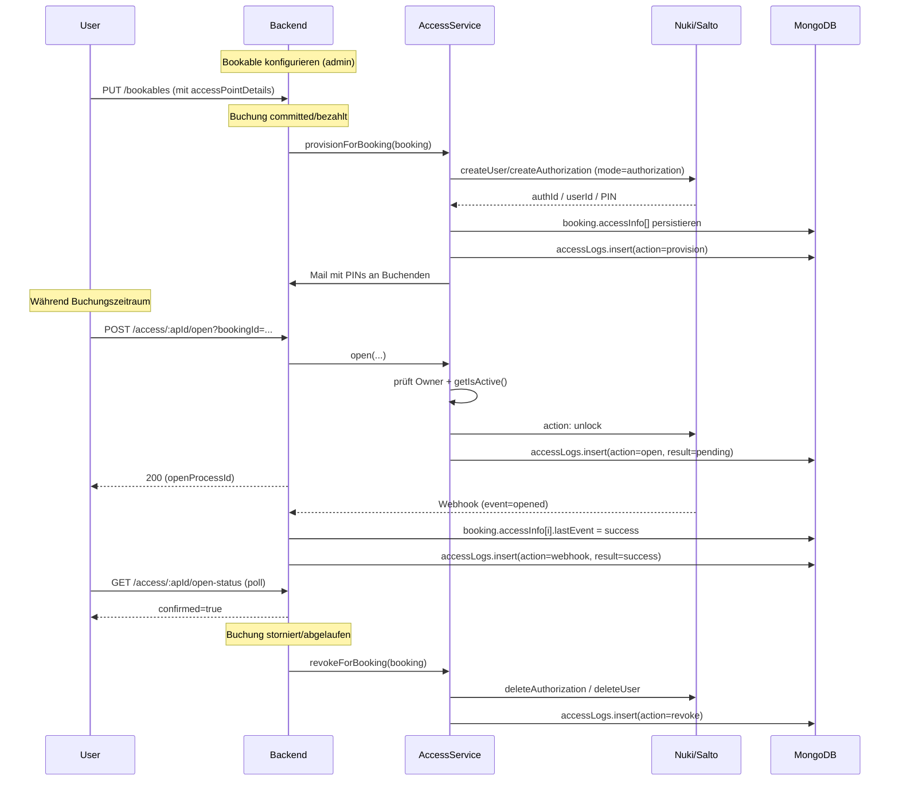
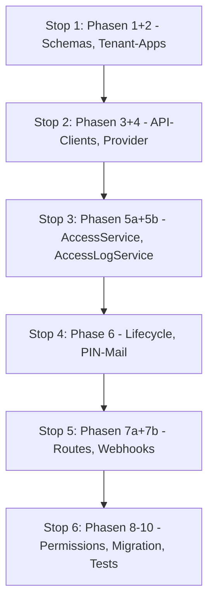

# Access-Points (Türen / Schließanlagen) – Implementierungsplan

Dieses Dokument beschreibt die Erweiterung der Booking-Plattform um die
Möglichkeit, einem Bookable Türen / Access-Points zuzuweisen. Eine gültige
Buchung berechtigt den Buchenden, diese Türen für den Zeitraum der Buchung zu
öffnen und zu schließen. Drittanbieter sind **Nuki Web API** und
**Salto KS Cloud REST API**. iFBS-Locker werden weiterhin als Subtyp eines
Access-Points behandelt (existierende Implementierung bleibt erhalten).

---

## 1. Designentscheidungen

| Thema | Entscheidung |
|---|---|
| Access-Modi | **Beides konfigurierbar pro Tür**: `remote` (Backend sendet Open/Close-Befehle), `authorization` (zeitbasierte Berechtigung beim Provider) und `both`. |
| Inventar | **Nicht-exklusiv**: eine Tür kann mehreren Bookables zugeordnet sein und mehrere Buchungen können sie parallel nutzen. Keine Reservierungs-/Inventarlogik wie beim `LockerService`. |
| Salto-User-Mapping | **Pro Buchung** wird ein neuer Salto-User angelegt und nach Ablauf/Stornierung wieder entfernt (per Cleanup-Job tolerant). |
| PIN-Auslieferung | **Per Mail** an den Buchenden **und** als Information an der Buchung (verschlüsselt persistiert, nur für Owner und Manager sichtbar). |
| Webhook-Handling | **Geplant**. Sowohl Nuki als auch Salto KS senden Events (z.B. „Tür geöffnet"); diese werden persistiert und als Rückmeldung im UI ausgegeben. |
| Logging | **Eigene MongoDB-Collection `accessLogs`** in der bestehenden DB. Append-only mit TTL-Index. Begründung siehe §5. |

---

## 2. Architektur-Überblick

```mermaid
flowchart LR
    Bookable -->|"accessPointDetails.points[]"| AP["AccessPoint(door)"]
    Booking -->|booking.accessInfo[]| Provisioned["provisionierte Authorizations + PINs"]
    AP -->|provider| Nuki["Nuki Web API"]
    AP -->|provider| Salto["Salto KS Cloud"]
    AccessService --> Resolve{Resolve}
    Resolve -->|"type=locker"| LockerInfo["booking.lockerInfo"]
    Resolve -->|"type=door"| BookableDoors["bookable.accessPointDetails.points + booking.accessInfo"]
    AccessService --> Provider["AccessProvider Registry"]
    Provider --> Nuki
    Provider --> Salto
    Provider --> IfbsAccessProvider
    AccessService --> AccessLog["AccessLogService -> accessLogs Collection"]
    Nuki -.webhook.-> WebhookCtrl["Webhook-Controller"]
    Salto -.webhook.-> WebhookCtrl
    WebhookCtrl --> AccessLog
    WebhookCtrl --> BookingAccessInfo["booking.accessInfo[].lastEvent"]
```

## 3. Lebenszyklus



---

## 4. Phasen & konkrete Änderungen

### Phase 1 – Domain-Modell und Schemas

1. **TenantApplication-Enum** in
   [src/commons/entities/application/tenantApplication.js](../src/commons/entities/application/tenantApplication.js)
   um `"access"` erweitern.

2. **AccessPoint-Erweiterung** in
   [src/commons/entities/access/access-point.js](../src/commons/entities/access/access-point.js):

   ```js
   const AccessPointType = Object.freeze({
     LOCKER: "locker",
     DOOR: "door",
   });

   const AccessPointMode = Object.freeze({
     REMOTE: "remote",
     AUTHORIZATION: "authorization",
     BOTH: "both",
   });
   ```

3. **Bookable-Schema** in
   [src/commons/schemas/bookableSchema.js](../src/commons/schemas/bookableSchema.js):
   neues Feld:

   ```js
   accessPointDetails: {
     type: Object,
     default: { active: false, points: [] },
   },
   ```

   Pro Eintrag in `points[]`:
   `{ id, provider, externalId, locationId?, label, mode, config? }`.
   Bewusst getrennt von `lockerDetails` (andere Semantik: nicht-exklusiv,
   keine Reservierung).

4. **Booking-Schema** in
   [src/commons/schemas/bookingSchema.js](../src/commons/schemas/bookingSchema.js):
   neues Feld:

   ```js
   accessInfo: { type: [Object], default: [] },
   ```

   Pro Eintrag:

   ```js
   {
     accessPointId: String,
     accessPointType: String,         // "door"
     provider: String,                // "nuki" | "salto-ks"
     externalId: String,              // smartlockId / lockId
     mode: String,                    // "remote" | "authorization" | "both"
     authorizationId: String,         // ID der Authorization beim Provider
     saltoUserId: String,             // nur bei salto-ks
     pin: Object,                     // verschlüsselt (SecurityUtils)
     isProvisioned: Boolean,
     provisionedAt: Number,
     lastEvent: {
       type: String,                  // "open" | "close" | "denied" | "battery_low"
       timestamp: Number,
       source: String,                // "user" | "webhook" | "system"
       success: Boolean,
       errorCode: String,
     },
   }
   ```

   `pin` wird beim Auslesen über `Booking.exportPublic()` und
   `exportStatus()` **niemals** mit ausgegeben.

5. **AccessLog-Schema** (neu):
   `src/commons/schemas/accessLogSchema.js`:

   ```js
   {
     id: String,                  // uuid
     tenantId: String,            // indexed
     bookingId: String,           // indexed
     accessPointId: String,       // indexed
     accessPointType: String,     // "locker" | "door"
     provider: String,            // "ifbs" | "nuki" | "salto-ks"
     externalId: String,
     action: String,              // "open" | "close" | "provision" | "revoke" | "status" | "webhook"
     actor: { userId, source },   // source: "user" | "system" | "webhook"
     result: String,              // "success" | "failure" | "pending"
     payload: Object,
     errorCode: String,
     errorMessage: String,
     timestamp: Number,           // indexed, TTL
   }
   ```

### Phase 2 – Tenant-Applications für Nuki und Salto KS

1. Neue Datei `src/commons/entities/application/accessApplication.js`
   analog zu
   [lockerApplication.js](../src/commons/entities/application/lockerApplication.js):
   - `AccessApplication` Basisklasse (`type: "access"`)
   - `NukiAccessApplication`: `apiToken` (verschlüsselt), `apiBaseUrl`
     (Default `https://api.nuki.io`), optionale OAuth-Variante
   - `SaltoKsAccessApplication`: `clientId`, `clientSecret` (verschlüsselt),
     `siteId`, `apiBaseUrl` (Default `https://clp-accept-user.saltoks.com`)
   - `createAccessApplication`-Factory + `registerAccessAppType`

2. [applicationFactory.js](../src/commons/entities/application/applicationFactory.js):
   Branch für `data.type === "access"` ergänzen, `createAccessApplication`
   aufrufen.

### Phase 3 – API-Clients

Analog zur Locker-Client-Struktur in
[src/commons/services/locker/clients/](../src/commons/services/locker/clients/).

Neue Struktur unter `src/commons/services/access/clients/`:

- `base-access-api-client.js` (Pendant zu
  [base-locker-api-client.js](../src/commons/services/locker/clients/base-locker-api-client.js))
- `nuki-api-client.js`
  - `getSmartlocks()` → `GET /smartlock`
  - `executeAction(smartlockId, action)` → `POST /smartlock/{id}/action`
    (1 = unlock, 2 = lock, 3 = unlatch, 4 = lock’n’go)
  - `getSmartlockState(id)` → `GET /smartlock/{id}/state`
  - `createAuthorization(smartlockId, { name, type, allowedFromDate, allowedUntilDate, code })`
    → `PUT /smartlock/{id}/auth` (Typ `keypad` mit `code`-PIN)
  - `deleteAuthorization(smartlockId, authId)`
  - `registerNotification(callbackUrl)` / `unregisterNotification(id)`
  - `static testConnection(apiToken)` → `GET /account`
- `salto-ks-api-client.js`
  - OAuth2 client-credentials Token-Caching (Refresh kurz vor `expires_in`)
  - `getLocks(siteId)`
  - `openLock(lockId)` (Remote-Open)
  - `createUser({ firstName, lastName, email })`
  - `assignAccess(userId, lockIds, validFrom, validTo, pin?)`
  - `revokeAccess(accessId)`
  - `deleteUser(userId)`
  - `subscribeNotifications(callbackUrl, eventTypes)`
  - `unsubscribeNotifications(subscriptionId)`
  - `static testConnection(...)`
- `access-client-registry.js` + `access-test-registry.js`
  (Pendants zu
  [locker-client-registry.js](../src/commons/services/locker/clients/locker-client-registry.js)
  und
  [locker-test-registry.js](../src/commons/services/locker/clients/locker-test-registry.js))
- `index.js`: registriert Nuki und Salto KS mit `extractArgs`-Funktion
  (decryption-aware analog zu
  [locker/clients/index.js](../src/commons/services/locker/clients/index.js)).

### Phase 4 – Access-Provider

1. Erweiterung von
   [access-provider.js](../src/commons/services/access/providers/access-provider.js)
   um neue optionale Methoden:

   ```js
   async grantAuthorization(accessPoint, bookingContext) { ... }
   async revokeAuthorization(accessPoint, bookingContext) { ... }
   async listAccessPoints(tenant) { ... }
   async registerWebhook(tenant, callbackUrl) { ... }
   async unregisterWebhook(tenant) { ... }
   parseWebhook(rawPayload, headers) { ... }
   verifyWebhookSignature(rawPayload, headers, secret) { ... }
   ```

2. `src/commons/services/access/providers/nuki-access-provider.js`:
   - `_getClient(tenant)` lädt aktive Nuki-App und entschlüsselt
   - `open()` → `executeAction(externalId, 1)`
   - `close()` → `executeAction(externalId, 2)`
   - `getStatus()` → `getSmartlockState`
   - `grantAuthorization()` mit `allowedFromDate`/`allowedUntilDate` aus
     `booking.timeBegin/timeEnd` und Typ `keypad` + generierter PIN
   - `revokeAuthorization()` über `deleteAuthorization`
   - `listAccessPoints()` → `getSmartlocks` (für UI bei Bookable-Konfiguration)
   - `registerWebhook` / `parseWebhook` / `verifyWebhookSignature`

3. `src/commons/services/access/providers/salto-ks-access-provider.js`:
   - analog mit `openLock`, `createUser`, `assignAccess`, `revokeAccess`,
     `deleteUser`
   - PIN wird per `assignAccess(..., pin)` mitgegeben (zufällig generiert)
   - Webhook-Subscription via `subscribeNotifications`

4. [register-access-providers.js](../src/commons/services/access/providers/register-access-providers.js):
   `nuki` und `salto-ks` zusätzlich zu `ifbs` registrieren.

### Phase 5a – AccessService erweitern

[access-service.js](../src/commons/services/access/access-service.js)
auflösen heute nur Locker via `booking.lockerInfo`. Anpassungen:

1. `_resolve()` muss zwischen Tür- und Locker-Access-Points unterscheiden:
   - Locker-Pfad: bestehende Logik via `booking.lockerInfo`
   - Door-Pfad: lädt Bookables aus `booking.bookableItems`, sammelt
     `bookable.accessPointDetails.points` und merged mit
     `booking.accessInfo[]` (für `authorizationId`, `pin`)

2. Implementierung von `getByBooking()` (heute TODO an Zeile 63):
   liefert eine vereinheitlichte Liste aller Access-Points der Buchung
   (Locker + Türen) inkl. Status (`isProvisioned`, `lastEvent`).

3. Neue Methoden:
   - `provisionForBooking(tenant, bookingId)`:
     iteriert über alle Door-Access-Points, ruft `grantAuthorization()` für
     `mode: authorization|both`, speichert Ergebnisse in
     `booking.accessInfo`, schreibt Log-Einträge, triggert PIN-Mail.
   - `revokeForBooking(tenant, bookingId)`: Pendant zum Aufheben.
   - `updateForBooking(tenant, oldBooking, newBooking)`: bei Zeitänderung
     Authorizations neu schreiben (revoke + grant) bzw. nur Zeitfenster
     aktualisieren falls API es unterstützt.

### Phase 5b – AccessLogService und Audit

1. Neue Dateien:
   - `src/commons/data-managers/models/accessLogModel.js`
   - `src/commons/data-managers/access-log-manager.js`
   - `src/commons/services/access/access-log-service.js`

2. `AccessLogService.log({ tenantId, bookingId, accessPointId, action, ... })`
   wird **append-only** ausgeführt. Indizes: `(tenantId, bookingId)`,
   `(tenantId, accessPointId)`, `timestamp` mit TTL.

3. Retention konfigurierbar via Env-Variable
   `ACCESS_LOG_RETENTION_DAYS` (Default 730).

4. Jede Operation in `AccessService` (`open`, `close`, `getOpenStatus`,
   `provisionForBooking`, `revokeForBooking`) sowie alle
   eingehenden Webhooks landen in `accessLogs`.

5. Bestehender `IfbsAccessProvider` wird ebenfalls so genutzt → einheitliche
   Audit-Sicht über alle Schließsysteme (iFBS, Nuki, Salto KS).

### Phase 6 – Lifecycle-Hooks im Checkout & PIN-Mail

1. In
   [src/commons/services/checkout/booking-service.js](../src/commons/services/checkout/booking-service.js)
   sind heute überall `LockerService.handleCreate/Update/Cancel`-Aufrufe
   (Zeilen 252, 497, 599, 605, 662, 765, 852, 890, 978, 1085).
   An denselben Stellen analog
   `AccessService.provisionForBooking` /
   `AccessService.updateForBooking` /
   `AccessService.revokeForBooking` einhängen.

   ```mermaid
   flowchart TD
       Commit[Booking commit/pay] --> L[LockerService.handleCreate]
       Commit --> A[AccessService.provisionForBooking]
       Update[Booking update] --> LU[LockerService.handleUpdate]
       Update --> AU[AccessService.updateForBooking]
       Cancel[Booking cancel/reject] --> LC[LockerService.handleCancel]
       Cancel --> AC[AccessService.revokeForBooking]
   ```

2. **PIN-Mail**:
   - Neues Mail-Template in [src/commons/mail-service](../src/commons/mail-service)
     (`accessProvisioned.hbs` o.ä., oder Erweiterung der
     Booking-Confirmation-Mail).
   - Wird gesendet, wenn `provisionForBooking()` erfolgreich PINs erzeugt
     hat. Inhalt: Bookable-Name, Türen-Liste, Zeitfenster, PINs.

3. **Salto KS – User-Lifecycle pro Buchung**:
   1. Beim `provisionForBooking`:
      - `createUser({ firstName, lastName, email })` aus den Buchungsdaten
      - `assignAccess(userId, lockIds, validFrom=timeBegin, validTo=timeEnd, pin=generated)`
      - Speichern in `booking.accessInfo[].saltoUserId` und
        `accessId`
   2. Beim `revokeForBooking`:
      - `revokeAccess(accessId)`
      - `deleteUser(saltoUserId)` (best-effort, Fehler werden geloggt)
   3. Cleanup-Job: Falls `deleteUser` fehlschlägt, periodischer
      Hintergrund-Job räumt orphaned Users auf.

4. **Nuki – Authorizations**:
   - Authorization-Typ `keypad` mit zufällig generierter `code`-PIN.
   - Nach Provisioning wird `authorizationId` in `accessInfo` gespeichert.
   - `revokeAuthorization` löscht via `deleteAuthorization`.

### Phase 7a – API-Routen und Controller

1. Erweiterung
   [access.routes.js](../src/platform/api/routes/access.routes.js):
   - `POST /:accessPointId/close` ergänzen (fehlt heute)
   - `GET /:accessPointId/status` (Live-Status der Tür / Locker)

2. [access-controller.js](../src/platform/api/controllers/access-controller.js):
   - `close` analog zu `open` implementieren
   - `getAccessPoints` (heute TODO bei Zeile 88) implementieren via
     `AccessService.getByBooking`

3. Neue Routen für Tenant-Konfiguration analog zu
   [locker.routes.js](../src/platform/api/routes/locker.routes.js):
   `src/platform/api/routes/access-app.routes.js`:
   - `GET /:tenant/access-apps/:provider/access-points`
     (UI: Türen aus Nuki/Salto auflisten zur Auswahl)
   - `POST /:tenant/access-apps/:provider/test`
     (Verbindungstest)

4. Neuer Controller
   `src/platform/api/controllers/access-app-controller.js` + Service
   `src/commons/services/access/access-info-service.js`
   (Pendant zu
   [locker-info-service.js](../src/commons/services/locker/locker-info-service.js)).

5. Routen einhängen in
   [api-router-tenant-related.js](../src/platform/api/api-router-tenant-related.js).

### Phase 7b – Webhooks

1. Neue Routen (in
   [api-router.js](../src/platform/api/api-router.js), tenant-unabhängig):
   - `POST /api/webhooks/access/nuki/:tenant`
   - `POST /api/webhooks/access/salto-ks/:tenant`
   - jeweils mit Provider-spezifischer Signatur-Verifikation als Middleware
     (HMAC oder Bearer)

2. Neuer Controller
   `src/platform/api/controllers/access-webhook-controller.js`:
   - Verifiziert Signatur via Provider-Helper
     (`AccessProvider.verifyWebhookSignature`)
   - Mappt Provider-Event auf interne Struktur
     (`AccessProvider.parseWebhook`)
   - Speichert Event in `accessLogs` (action: `webhook`)
   - Aktualisiert `booking.accessInfo[].lastEvent`
     (Status, Zeitstempel, errorCode)
   - Antwortet schnell mit `200`

3. **Auto-Registration** der Webhooks:
   - Beim Aktivieren einer `nuki` / `salto-ks`-Tenant-Application wird
     automatisch `provider.registerWebhook(tenant, callbackUrl)` aufgerufen.
   - Beim Deaktivieren `unregisterWebhook`.
   - Manueller Re-Register-Endpoint:
     `POST /:tenant/access-apps/:provider/webhook/register`.

4. **Frontend-Rückmeldung**:
   - Webhooks aktualisieren `accessInfo[].lastEvent`.
   - Bestehender Endpoint `GET /access/:apId/open-status` liest für
     non-iFBS-Provider aus der DB (Webhook-getrieben), für iFBS bleibt
     das bestehende Polling per `waitForOpenBox`.
   - Frontend kann das Polling-Muster wie heute beibehalten — keine
     Frontend-Änderung erzwungen.
   - **Optional Phase 11**: SSE-/WebSocket-Endpoint für Echtzeit-Push.

### Phase 8 – Permissions

Bestehende Berechtigungen reichen aus:

- `MANAGE_BOOKABLES` – Konfiguration der Access-Points am Bookable
- `MANAGE_TENANTS` – Verwaltung der Nuki/Salto-Apps am Tenant
- Runtime-Open/Close: Owner-Check + `getIsActive()` (bereits in
  `AccessController._canOperate` an
  [access-controller.js#L114](../src/platform/api/controllers/access-controller.js)
  implementiert)

Webhook-Endpoints sind authentifiziert über Provider-Signatur, **nicht**
über Tenant-Auth.

### Phase 9 – Datenbank-Migration

1. Migration-Skript in `migrations/` analog zu existierenden:
   - Setze `accessPointDetails: { active: false, points: [] }` als Default
     für alle bestehenden Bookables.
   - Setze `accessInfo: []` für alle bestehenden Bookings.
   - Erstelle `accessLogs`-Collection mit Indizes
     (`tenantId`, `bookingId`, `accessPointId`, `timestamp` TTL).

2. Prüfen, ob ein Pre-Save-Hook ähnlich zu `ensureIfbsProvider` in
   [bookableModel.js](../src/commons/data-managers/models/bookableModel.js)
   nötig ist (vermutlich nicht, da Türen keine externen Pricing-Provider sind).

### Phase 10 – Tests

Mocha-Tests im `tests/`-Verzeichnis:

- Provider-Tests mit gemockten HTTP-Responses (Nuki, Salto KS)
- AccessService-Tests:
  - `_resolve` für door vs. locker
  - `provisionForBooking`, `revokeForBooking`
  - Time-window-Permissions
- Controller-Integrationstests für Open/Close/Status
- Lifecycle-Tests (provision/update/revoke bei Booking-Änderungen)
- Webhook-Tests (Signatur-Verifikation, Event-Mapping, Idempotenz)
- AccessLogService-Tests (append-only, TTL)

---

## 5. Begründung Logging in MongoDB

Für die Schließanlagen-Logs wird eine **eigene Collection in der
bestehenden MongoDB** eingesetzt, **nicht** eine separate DB oder eine
Time-Series-DB.

**Pro MongoDB (gleiche DB):**

- Volumen ist überschaubar (typisch: einige hundert bis wenige tausend
  Events pro Tag und Tenant — Türöffnungen, Status-Änderungen,
  Provisioning-Events).
- Audit-Queries sind fast immer relational zur Buchung/Benutzer/Tenant —
  Joins/Lookups funktionieren mit gleicher DB direkt.
- Existierende Infrastruktur, Backup, Restore und Multi-Tenant-Isolation
  sind schon erprobt.
- TTL-Indizes lassen sich für Retention einfach setzen
  (`expireAfterSeconds`, z.B. 2 Jahre konfigurierbar via Env).
- Append-only-Pattern ist einfach: nie `update`, nur `insert`.

**Gegen separate DB / Time-Series-DB (InfluxDB o.ä.):**

- Zusätzliche Infra-Dependency, neue Backup-/Monitoring-/Auth-Konzepte.
- Cross-DB-Queries (z.B. „alle Logs zu dieser Buchung") wären umständlicher.
- Time-Series-DBs lohnen sich erst ab ca. >100k Events/Tag/Tenant.

---

## 6. Umsetzungs-Stops (Inkrementelle Reihenfolge)



Nach jedem Stop wird ein Review eingeholt, bevor mit dem nächsten Stop
fortgefahren wird.

---

## 7. Offene Punkte (zukünftig)

1. **SSE / WebSocket** für Echtzeit-Rückmeldung statt Polling – optional.
2. **Pareva-Locker als Access-Provider** angleichen (analog zu iFBS).
3. **Audit-Export** als CSV / PDF pro Tenant für Compliance.
4. **Cleanup-Job** für orphaned Salto-User (geplante Hintergrund-Aufgabe).
