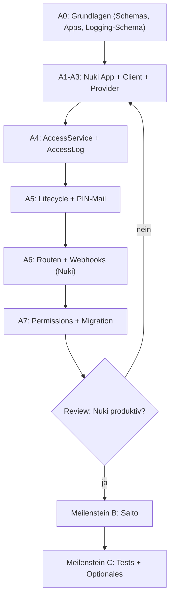

# Access-Points – Umsetzungs-Tracking

Tracking-Board zum [ACCESS_POINTS_IMPLEMENTATION_PLAN.md](./ACCESS_POINTS_IMPLEMENTATION_PLAN.md).
Frontend-Handover für Nuki: [ACCESS_POINTS_FRONTEND_NUKI.md](./ACCESS_POINTS_FRONTEND_NUKI.md).

**Strategie:** Zuerst **Nuki** vollständig integrieren und produktiv testen
(Meilenstein A). Erst wenn Nuki stabil läuft, **Salto KS** ergänzen
(Meilenstein B). Gemeinsame Grundlagen (Schemas, Service-Gerüst, Logging)
werden so gebaut, dass Salto später ohne Umbau andocken kann.

## Status-Legende

| Symbol | Bedeutung |
|---|---|
| ⬜ | Offen / noch nicht begonnen |
| 🟡 | In Arbeit |
| ✅ | Fertig & reviewed |
| ⏭️ | Übersprungen / verschoben |
| 🚧 | Blockiert (siehe Notiz) |

## Fortschritt gesamt

| Meilenstein | Status | Fortschritt |
|---|---|---|
| **A. Nuki-Integration** | 🟡 | A0-A7 weitgehend fertig · 7.5 / 8 Blöcke (nur A6.6 Auto-Register offen) |
| **B. Salto-KS-Integration** | ⬜ | 0 / 5 Phasen |
| **C. Übergreifend (Tests, Doku)** | ⬜ | 0 / 2 Phasen |

> Felder bei jeder Aufgabe aktuell halten: Status-Symbol, optional
> Bearbeiter:in + Datum in der Notiz-Spalte.

---

## Meilenstein A – Nuki-Integration

> Ziel: Ein Bookable kann eine Nuki-Tür zugewiesen bekommen, eine gültige
> Buchung provisioniert Authorization + PIN, Tür lässt sich remote
> öffnen/schließen, Events kommen per Webhook zurück.

### A0 – Gemeinsame Grundlagen (provider-unabhängig)

Diese Basis wird für beide Provider gebraucht; wird im Rahmen von Nuki
mitgebaut.

| # | Aufgabe | Plan-Ref | Status | Notiz |
|---|---|---|---|---|
| A0.1 | `tenantApplication.js` um `"access"` erweitern | Phase 1.1 | ✅ | enum erweitert |
| A0.2 | `AccessPointType` / `AccessPointMode` in `access-point.js` | Phase 1.2 | ✅ | DOOR + Mode-Enum ergänzt |
| A0.3 | `bookableSchema.js`: Feld `accessPointDetails` | Phase 1.3 | ✅ | Default `{active:false, points:[]}` |
| A0.4 | `bookingSchema.js`: Feld `accessInfo` (PIN verschlüsselt, nie in `exportPublic`) | Phase 1.4 | ✅ | nicht in `exportPublic`/`exportStatus` |
| A0.5 | `accessLogSchema.js` (neu) | Phase 1.5 | ✅ | Definition-Export, TTL-Index in A4.6 |
| A0.6 | `AccessApplication`-Basisklasse + Factory-Branch `type === "access"` | Phase 2 | ✅ | konkrete Apps in A1.1/B1.1 |

### A1 – Nuki Tenant-Application

| # | Aufgabe | Plan-Ref | Status | Notiz |
|---|---|---|---|---|
| A1.1 | `NukiAccessApplication` (`apiToken` verschlüsselt, `apiBaseUrl`) | Phase 2.1 | ✅ | Default `https://api.nuki.io`, `apiToken` encrypt/decrypt |
| A1.2 | Registrierung in `createAccessApplication` / `applicationFactory` | Phase 2.2 | ✅ | `id: "nuki"` registriert, Factory-Check grün |

### A2 – Nuki API-Client

| # | Aufgabe | Plan-Ref | Status | Notiz |
|---|---|---|---|---|
| A2.1 | `base-access-api-client.js` | Phase 3 | ✅ | Base-Methoden + Connection-Error-Mapping |
| A2.2 | `nuki-api-client.js`: `getSmartlocks`, `executeAction`, `getSmartlockState` | Phase 3 | ✅ | inkl. `getAccessPoints`/`getStatus` Alias |
| A2.3 | `nuki-api-client.js`: `createAuthorization` / `deleteAuthorization` (keypad-PIN) | Phase 3 | ✅ | Payload wird unverändert an Nuki übergeben |
| A2.4 | `nuki-api-client.js`: `registerNotification` / `unregisterNotification` | Phase 3 | ✅ | Callback-Client-Methoden vorhanden |
| A2.5 | `nuki-api-client.js`: `testConnection` (`GET /account`) | Phase 3 | ✅ | Registry-Test-Handler nutzt `apiToken` |
| A2.6 | `access-client-registry.js` + `access-test-registry.js` + `index.js` | Phase 3 | ✅ | Nuki registriert, decrypt-aware Client-Erzeugung |

### A3 – Nuki Access-Provider

| # | Aufgabe | Plan-Ref | Status | Notiz |
|---|---|---|---|---|
| A3.1 | `access-provider.js` um neue Methoden erweitern (grant/revoke/list/webhook) | Phase 4.1 | ✅ | Default-Fehler für optionale Methoden |
| A3.2 | `nuki-access-provider.js`: `open` / `close` / `getStatus` | Phase 4.2 | ✅ | unlock/lock/state über Nuki-Client |
| A3.3 | `nuki-access-provider.js`: `grantAuthorization` / `revokeAuthorization` | Phase 4.2 | ✅ | keypad-PIN + Authorization-ID-Rückgabe |
| A3.4 | `nuki-access-provider.js`: `listAccessPoints` | Phase 4.2 | ✅ | Smartlocks auf interne Door-Struktur gemappt |
| A3.5 | `nuki-access-provider.js`: `registerWebhook` / `parseWebhook` / `verifyWebhookSignature` | Phase 4.2 | ✅ | Callback-Methoden + HMAC-Helfer |
| A3.6 | Registrierung `nuki` in `register-access-providers.js` | Phase 4.4 | ✅ | Provider-Registry-Check grün |

### A4 – AccessService + AccessLogService

| # | Aufgabe | Plan-Ref | Status | Notiz |
|---|---|---|---|---|
| A4.1 | `_resolve()` Door- vs. Locker-Pfad | Phase 5a.1 | ✅ | Locker bleibt, Door über Bookables + `accessInfo` |
| A4.2 | `getByBooking()` implementieren (TODO ~Z.63) | Phase 5a.2 | ✅ | vereinheitlichte Locker-/Door-Liste ohne PIN |
| A4.3 | `provisionForBooking` / `revokeForBooking` / `updateForBooking` | Phase 5a.3 | ✅ | Nuki Authorization-Lifecycle vorbereitet |
| A4.4 | `accessLogModel.js` + `access-log-manager.js` + `access-log-service.js` | Phase 5b.1 | ✅ | append-only `AccessLogService.log` |
| A4.5 | Logging in alle AccessService-Operationen + IfbsProvider einhängen | Phase 5b.4-5 | ✅ | open/close/status/provision/revoke via Service |
| A4.6 | Retention via `ACCESS_LOG_RETENTION_DAYS` (TTL-Index) | Phase 5b.3 | ✅ | `expiresAt` TTL, Default 730 Tage |

### A5 – Lifecycle-Hooks + PIN-Mail

| # | Aufgabe | Plan-Ref | Status | Notiz |
|---|---|---|---|---|
| A5.1 | `booking-service.js`: `provision/update/revoke` an Locker-Hooks andocken | Phase 6.1 | ✅ | Create/Commit/Pay/Update/Cancel/Reject angebunden |
| A5.2 | PIN-Mail-Template + Versand bei erfolgreichem Provisioning | Phase 6.2 | ✅ | `access-provisioned` Mail mit neu erzeugten PINs |
| A5.3 | Nuki Authorization-Lifecycle (keypad-PIN, `authorizationId` speichern) | Phase 6.4 | ✅ | Lifecycle über A3/A4 Provider + `booking.accessInfo` |

### A6 – Routen, Controller & Webhooks

| # | Aufgabe | Plan-Ref | Status | Notiz |
|---|---|---|---|---|
| A6.1 | `access.routes.js`: `POST /:id/close`, `GET /:id/status` | Phase 7a.1 | ✅ | Runtime-Routen ergänzt |
| A6.2 | `access-controller.js`: `close` + `getAccessPoints` (TODO ~Z.88) | Phase 7a.2 | ✅ | `close`, `status`, `getAccessPoints` aktiv |
| A6.3 | `access-app.routes.js` + `access-app-controller.js` + `access-info-service.js` | Phase 7a.3-4 | ✅ | Provider, Access-Points, Test, Webhook-Register |
| A6.4 | Routen in `api-router-tenant-related.js` einhängen | Phase 7a.5 | ✅ | `/access-apps` registriert |
| A6.5 | Webhook-Route `POST /api/webhooks/access/nuki/:tenant` + Controller | Phase 7b.1-2 | ✅ | generisch via `/webhooks/access/:provider/:tenant` |
| A6.6 | Auto-Register Webhook bei Aktivierung der Nuki-App + Re-Register-Endpoint | Phase 7b.3 | 🟡 | manueller Register-/Unregister-Endpoint fertig; Auto-Register wartet auf persistierte Webhook-ID |
| A6.7 | `open-status` für Nuki webhook-getrieben aus DB lesen | Phase 7b.4 | ✅ | liest `accessInfo.lastEvent`, fallback Live-Status |

### A7 – Permissions & Migration (für Nuki produktiv)

| # | Aufgabe | Plan-Ref | Status | Notiz |
|---|---|---|---|---|
| A7.1 | Permissions prüfen (`MANAGE_BOOKABLES`, `MANAGE_TENANTS`, Owner-Check) | Phase 8 | ✅ | Runtime: Owner+aktiv/`MANAGE_BOOKINGS`; Config: `MANAGE_BOOKABLES`(R)/`MANAGE_TENANTS`(W) |
| A7.2 | Migration: Defaults `accessPointDetails` / `accessInfo`, `accessLogs`-Collection + Indizes | Phase 9 | ✅ | `03-06-2026-add-access-points.js` (createCollection + syncIndexes) |

**✅ Definition of Done Meilenstein A (Nuki):**
- [ ] Bookable kann Nuki-Tür zugewiesen bekommen (UI listet Smartlocks)
- [ ] Buchung provisioniert Authorization + PIN, PIN-Mail kommt an
- [ ] Tür remote öffnen/schließen funktioniert end-to-end
- [ ] Webhook-Event landet in `accessLogs` und aktualisiert `lastEvent`
- [ ] Stornierung/Ablauf entfernt die Authorization
- [ ] In Staging mit echter Nuki-Hardware/Sandbox getestet

---

## Meilenstein B – Salto-KS-Integration

> Erst starten, wenn Meilenstein A grün ist. Baut auf derselben Basis (A0,
> A4, Webhook-Infra) auf – nur provider-spezifische Teile kommen dazu.

### B1 – Salto Tenant-Application

| # | Aufgabe | Plan-Ref | Status | Notiz |
|---|---|---|---|---|
| B1.1 | `SaltoKsAccessApplication` (`clientId`/`clientSecret` verschlüsselt, `siteId`, `apiBaseUrl`) | Phase 2.1 | ⬜ | |

### B2 – Salto API-Client

| # | Aufgabe | Plan-Ref | Status | Notiz |
|---|---|---|---|---|
| B2.1 | `salto-ks-api-client.js`: OAuth2 client-credentials + Token-Caching | Phase 3 | ⬜ | |
| B2.2 | `getLocks` / `openLock` | Phase 3 | ⬜ | |
| B2.3 | `createUser` / `assignAccess` / `revokeAccess` / `deleteUser` | Phase 3 | ⬜ | |
| B2.4 | `subscribeNotifications` / `unsubscribeNotifications` / `testConnection` | Phase 3 | ⬜ | |
| B2.5 | Salto in `access-client-registry` / `index.js` registrieren | Phase 3 | ⬜ | |

### B3 – Salto Access-Provider

| # | Aufgabe | Plan-Ref | Status | Notiz |
|---|---|---|---|---|
| B3.1 | `salto-ks-access-provider.js`: `open` / `getStatus` | Phase 4.3 | ⬜ | |
| B3.2 | `grantAuthorization` (createUser + assignAccess + PIN) / `revokeAuthorization` | Phase 4.3 | ⬜ | |
| B3.3 | Webhook (`subscribeNotifications` / `parseWebhook` / `verifyWebhookSignature`) | Phase 4.3 | ⬜ | |
| B3.4 | Registrierung `salto-ks` in `register-access-providers.js` | Phase 4.4 | ⬜ | |

### B4 – Salto-spezifischer Lifecycle & Webhook-Route

| # | Aufgabe | Plan-Ref | Status | Notiz |
|---|---|---|---|---|
| B4.1 | Salto-User-Lifecycle pro Buchung (`saltoUserId`/`accessId` speichern) | Phase 6.3 | ⬜ | |
| B4.2 | Cleanup-Job für orphaned Salto-User | Phase 6.3 / 7-Offen | ⬜ | |
| B4.3 | Webhook-Route `POST /api/webhooks/access/salto-ks/:tenant` | Phase 7b.1 | ⬜ | |
| B4.4 | Auto-Register Webhook bei Aktivierung der Salto-App | Phase 7b.3 | ⬜ | |

### B5 – Migration / Aktivierung Salto

| # | Aufgabe | Plan-Ref | Status | Notiz |
|---|---|---|---|---|
| B5.1 | Salto in Staging mit echter Site/Sandbox testen | Phase 9/10 | ⬜ | |

**✅ Definition of Done Meilenstein B (Salto):**
- [ ] Bookable kann Salto-Tür zugewiesen bekommen
- [ ] Buchung legt Salto-User an, weist Zugang + PIN zu
- [ ] Remote-Open funktioniert
- [ ] Webhook-Events landen in `accessLogs`
- [ ] Revoke entfernt Access + User (Cleanup greift bei Fehlern)

---

## Meilenstein C – Übergreifend

### C1 – Tests

| # | Aufgabe | Plan-Ref | Status | Notiz |
|---|---|---|---|---|
| C1.1 | Provider-Tests (gemockte HTTP-Responses, Nuki) | Phase 10 | ⬜ | |
| C1.2 | AccessService-Tests (`_resolve`, provision/revoke, Time-Window) | Phase 10 | ⬜ | |
| C1.3 | Controller-Integrationstests (open/close/status) | Phase 10 | ⬜ | |
| C1.4 | Webhook-Tests (Signatur, Mapping, Idempotenz) | Phase 10 | ⬜ | |
| C1.5 | AccessLogService-Tests (append-only, TTL) | Phase 10 | ⬜ | |
| C1.6 | Salto-Provider-Tests (nach Meilenstein B) | Phase 10 | ⬜ | |

### C2 – Optionale/zukünftige Punkte

| # | Aufgabe | Plan-Ref | Status | Notiz |
|---|---|---|---|---|
| C2.1 | SSE/WebSocket für Echtzeit-Push statt Polling | Phase 11 / 7-Offen | ⬜ | |
| C2.2 | Pareva-Locker als Access-Provider angleichen | 7-Offen | ⬜ | |
| C2.3 | Audit-Export (CSV/PDF) pro Tenant | 7-Offen | ✅ | `GET /:tenant/access/audit/export?format=csv\|pdf` (`AccessAuditService` + `AccessAuditController`), Filter (from/to/bookingId/accessPointId/provider/action/result), PIN/Token-Redaction, `MANAGE_BOOKINGS` readAny |

---

## Reihenfolge (Stops mit Review)

Nach jedem Block wird ein Review eingeholt, bevor weitergearbeitet wird.
Der Sprung zu Salto (Meilenstein B) passiert erst nach grünem Review von
Meilenstein A.
