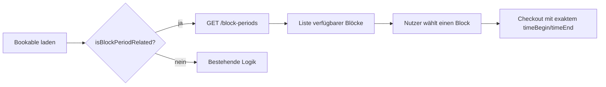

# Block Periods — Frontend-Integrationsleitfaden

Dieses Dokument beschreibt, was Frontend-Entwickler für **Admin-Einstellungen** und **Checkout** umsetzen müssen, damit Buchungsobjekte mit tagesübergreifenden Block-Perioden (z. B. Wochenende, Arbeitswoche) korrekt konfiguriert und gebucht werden können.

---

## 1. Konzept

**Block Period** = wiederkehrendes, tagesübergreifendes Buchungsfenster, das **nur als Ganzes** gebucht werden kann.

| Beispiel | Start | Ende | Dauer |
|----------|-------|------|-------|
| Wochenende | Sa 08:00 | So 20:00 | 36 h |
| Arbeitswoche | Mo 08:00 | Fr 18:00 | 5 Tage |
| Verlängertes WE | Fr 18:00 | Mo 08:00 | über Wochenende |

Der Nutzer wählt **keine freie Zeit** und **keinen Teilausschnitt** — er wählt eine konkrete Instanz (z. B. „Wochenende 07.–08.06.2026").

---

## 2. Buchungstyp erkennen

Ein Bookable ist Block-Period-typ, wenn:

```json
{
  "isBlockPeriodRelated": true
}
```

**Wichtig:** Es darf **genau ein** Buchungsmodus-Flag aktiv sein:

| Flag | Bedeutung |
|------|-----------|
| `isScheduleRelated` | Freie Zeitauswahl |
| `isTimePeriodRelated` | Feste Tages-Slots |
| `isLongRange` | Kalender-Einheiten (Woche/Monat) |
| `isBlockPeriodRelated` | Block Periods (neu) |

Wenn keines `true` ist → nicht zeitabhängig.

### Routing im Frontend

```
bookable.isBlockPeriodRelated === true  →  Block-Period-Checkout-UI
bookable.isScheduleRelated === true     →  Kalender / freie Zeitauswahl
bookable.isTimePeriodRelated === true   →  Slot-Auswahl
bookable.isLongRange === true           →  Long-Range-UI
sonst                                   →  Keine Zeitauswahl
```

---

## 3. Admin / Einstellungen — Block Period anlegen

### 3.1 Felder am Bookable

Beim Speichern über `PUT /api/:tenant/bookables` (bestehender Endpoint):

```json
{
  "isBlockPeriodRelated": true,
  "isScheduleRelated": false,
  "isTimePeriodRelated": false,
  "isLongRange": false,

  "blockPeriods": [
    {
      "id": "weekend",
      "label": "Wochenende",
      "startWeekday": 6,
      "startTime": "08:00",
      "endWeekday": 0,
      "endTime": "20:00"
    },
    {
      "id": "workweek",
      "label": "Arbeitswoche",
      "startWeekday": 1,
      "startTime": "08:00",
      "endWeekday": 5,
      "endTime": "18:00"
    }
  ]
}
```

Die Felder `isBlockPeriodRelated` und `blockPeriods` werden auch in `exportPublic()` mitgeliefert (öffentliche Bookable-Ansicht).

### 3.2 Schema pro Block-Period-Eintrag

| Feld | Typ | Pflicht | Beschreibung |
|------|-----|---------|--------------|
| `id` | `string` | ja | Eindeutig **innerhalb des Bookables** (z. B. `weekend`, `workweek`) |
| `label` | `string` | ja | Anzeigename im Checkout (z. B. „Wochenende") |
| `startWeekday` | `number` 0–6 | ja | Start-Wochentag |
| `startTime` | `string` | ja | Startzeit, Format `HH:mm` (24 h) |
| `endWeekday` | `number` 0–6 | ja | End-Wochentag |
| `endTime` | `string` | ja | Endzeit, Format `HH:mm` (24 h) |

### 3.3 Wochentage

Konvention wie `Date.getDay()` in JavaScript:

| Zahl | Tag |
|------|-----|
| 0 | Sonntag |
| 1 | Montag |
| 2 | Dienstag |
| 3 | Mittwoch |
| 4 | Donnerstag |
| 5 | Freitag |
| 6 | Samstag |

### 3.4 Wochen-Sprung (über Wochenende hinaus)

Blöcke dürfen über den Wochenwechsel hinausgehen. Beispiel „Fr 18:00 → Mo 08:00":

```json
{
  "id": "long-weekend",
  "label": "Verlängertes Wochenende",
  "startWeekday": 5,
  "startTime": "18:00",
  "endWeekday": 1,
  "endTime": "08:00"
}
```

Regel für die UI-Hilfe:
- `endWeekday > startWeekday` → Endtag in derselben Woche
- `endWeekday < startWeekday` → Endtag in der Folgewoche
- `endWeekday === startWeekday` und `endTime <= startTime` → Endtag eine Woche später

### 3.5 Validierung (Backend — im Formular abbilden)

| Regel | Fehlermeldung (Backend) |
|-------|-------------------------|
| Mindestens eine `blockPeriod`, wenn `isBlockPeriodRelated: true` | `blockPeriods must contain at least one entry…` |
| `id` eindeutig pro Bookable | `duplicate id "…"` |
| `id` / `label` nicht leer | Pflichtfeld-Fehler |
| Wochentag 0–6 | `must be an integer between 0 and 6` |
| Zeit `HH:mm` | `must be a time string in HH:mm format` |
| Dauer > 0 | `must have a duration greater than zero` |
| Nur ein Buchungsmodus-Flag | `Only one booking mode flag may be true at a time` |

### 3.6 UI-Empfehlung Admin

```
┌─────────────────────────────────────────────────────┐
│ Buchungstyp:  ( ) Freie Zeit                        │
│               ( ) Feste Slots                       │
│               ( ) Langzeit (Woche/Monat)            │
│               (•) Block Periods                     │
├─────────────────────────────────────────────────────┤
│ Block Periods                          [+ Hinzufügen]│
│ ┌─────────────────────────────────────────────────┐ │
│ │ ID: weekend    Label: Wochenende                │ │
│ │ Von: [Sa ▼] [08:00]  Bis: [So ▼] [20:00]       │ │
│ │                                        [Löschen]│ │
│ └─────────────────────────────────────────────────┘ │
│ ┌─────────────────────────────────────────────────┐ │
│ │ ID: workweek   Label: Arbeitswoche              │ │
│ │ Von: [Mo ▼] [08:00]  Bis: [Fr ▼] [18:00]       │ │
│ │                                        [Löschen]│ │
│ └─────────────────────────────────────────────────┘ │
└─────────────────────────────────────────────────────┘
```

**Hinweise für Admins (Tooltip / Hilfetext):**
- Öffnungszeiten werden bei Block Periods **nicht** geprüft.
- `minBookingDuration` / `maxBookingDuration` gelten **nicht** (Dauer ist fix).
- Mehrere Block-Period-Definitionen sind erlaubt (z. B. Wochenende + Arbeitswoche).

---

## 4. Preisgestaltung

Block Periods nutzen die **bestehende Preislogik** (`priceType`, `priceCategories`). Kein separates Preisfeld pro Block.

| `priceType` | Verhalten |
|-------------|-----------|
| `per-item` | Ein Preis pro Block (empfohlen mit `fixedPrice: true`) |
| `per-day` | Anzahl Kalendertage im Block |
| `per-hour` | Summe der Stunden über alle Tage |
| `per-square-meter` | Wie `per-item` |

Unterschiedliche Preise pro Block-Typ über `priceCategories[].weekdays`:

```json
{
  "priceCategories": [
    { "priceEur": 80, "fixedPrice": true, "weekdays": [6, 0] },
    { "priceEur": 200, "fixedPrice": true, "weekdays": [1, 2, 3, 4, 5] }
  ],
  "priceType": "per-item"
}
```

Der `/block-periods`-Endpoint liefert `priceEur` pro verfügbarer Instanz bereits berechnet.

---

## 5. Checkout — Was zu erweitern ist

### 5.1 Ablauf



### 5.2 API: Verfügbare Block Periods laden

```
GET /api/:tenant/bookables/:bookableId/block-periods
    ?startDate=2026-06-01
    &endDate=2026-06-30
    &amount=1
```

Auth: optional (wie `/availability`).

**Response:**

```json
{
  "title": "Camping Stellplatz A",
  "blockPeriods": [
    {
      "blockPeriodId": "weekend",
      "label": "Wochenende",
      "timeBegin": 1749286800000,
      "timeEnd": 1749398400000,
      "available": true,
      "priceEur": 80
    },
    {
      "blockPeriodId": "weekend",
      "label": "Wochenende",
      "timeBegin": 1749891600000,
      "timeEnd": 1750003200000,
      "available": false,
      "reason": "availability"
    }
  ]
}
```

| Response-Feld | Beschreibung |
|---------------|--------------|
| `blockPeriodId` | Referenz zur Definition (`blockPeriods[].id`) |
| `label` | Anzeigename |
| `timeBegin` / `timeEnd` | Exakte Epoch-Millis der Instanz — **1:1 an Checkout übergeben** |
| `available` | Buchbar? |
| `reason` | Nur wenn `available: false` (siehe Tabelle unten) |
| `priceEur` | Nur wenn `available: true` |

**Query-Parameter:**

| Parameter | Default | Beschreibung |
|-----------|---------|--------------|
| `startDate` | heute | Start des Abfragezeitraums |
| `endDate` | start + 7 Tage | Ende des Abfragezeitraums |
| `amount` | `1` | Gewünschte Stückzahl |

**Fehler:**

| HTTP | `code` | Bedeutung |
|------|--------|-----------|
| 404 | `bookable_not_found` | Bookable existiert nicht |
| 400 | `not_block_period_bookable` | Bookable ist kein Block-Period-Typ |

### 5.3 Alternative: Kalender-Endpoint

Der bestehende Endpoint funktioniert ebenfalls:

```
GET /api/:tenant/bookables/:id/availability?startDate=…&endDate=…&amount=1
```

Liefert Segmente mit `timeBegin` / `timeEnd`. Für Block Periods sind das **nur volle Block-Instanzen** — kein Freitext-Kalender nötig. Der dedizierte `/block-periods`-Endpoint ist UX-freundlicher (Label, Preis, `blockPeriodId`).

### 5.4 Checkout-Request

Bestehender Checkout — **keine neuen Felder**. Der Block wird über exakte Timestamps übergeben:

```json
{
  "bookableId": "camping-a",
  "timeBegin": 1749286800000,
  "timeEnd": 1749398400000,
  "amount": 1
}
```

**Kritisch:** `timeBegin` und `timeEnd` müssen **exakt** der gewählten Instanz aus `/block-periods` entsprechen. Teilauswahl (z. B. nur Samstag) wird abgelehnt.

Optional kann das Frontend `blockPeriodId` lokal mitspeichern (Analytics, Anzeige) — das Backend erwartet es im Checkout **nicht**.

### 5.5 Checkout-Validierung (Backend)

Reihenfolge der relevanten Checks:

| Check | Block Period Verhalten |
|-------|------------------------|
| Öffnungszeiten | **Übersprungen** |
| Block Period | Exakte Instanz-Prüfung |
| min/max Duration | **Übersprungen** |
| Verfügbarkeit / Kapazität | Prüfung über gesamten Block |

### 5.6 Fehlerbehandlung Checkout

Neuer Check-Typ: `block-period`  
Neuer i18n-Key: **`checkout.block_period_mismatch`**

Anzeige wenn der Nutzer (oder ein manipulierter Request) nicht die volle Periode bucht.

Beispiel normalisierte Checkout-Antwort:

```json
{
  "reason": "checkout.block_period_mismatch",
  "checkType": "block-period",
  "debugMessage": "Für das Objekt Camping A muss eine vollständige Block-Periode gebucht werden."
}
```

Weitere `reason`-Werte aus `/block-periods` (wenn `available: false`):

| `reason` | Bedeutung | UX-Hinweis |
|----------|-----------|--------------|
| `availability` | Kapazität belegt | „Bereits ausgebucht" |
| `permission` | Keine Berechtigung | Login / Rolle prüfen |
| `block-period-mismatch` | Ungültiges Zeitfenster | Sollte in normaler UI nicht vorkommen |
| `max-booking-date` | Zu weit in der Zukunft | Früheren Zeitraum wählen |
| `parent-availability` | Übergeordnetes Objekt belegt | — |
| `child-bookings` | Abhängiges Objekt belegt | — |
| `event-date` / `event-seats` | Event-Regeln | Nur bei Tickets |

---

## 6. UI-Empfehlung Checkout

```
┌─────────────────────────────────────────────────────┐
│ Camping Stellplatz A                                │
├─────────────────────────────────────────────────────┤
│ ◀ Juni 2026 ▶                                       │
│                                                     │
│ ┌─────────────────────────────────────────────────┐ │
│ │ Wochenende                                      │ │
│ │ Sa, 07.06. 08:00 – So, 08.06. 20:00           │ │
│ │ 80,00 €                              Verfügbar │ │
│ └─────────────────────────────────────────────────┘ │
│ ┌─────────────────────────────────────────────────┐ │
│ │ Wochenende                                      │ │
│ │ Sa, 14.06. 08:00 – So, 15.06. 20:00           │ │
│ │ Ausgebucht                                      │ │
│ └─────────────────────────────────────────────────┘ │
│ ┌─────────────────────────────────────────────────┐ │
│ │ Arbeitswoche                                    │ │
│ │ Mo, 09.06. 08:00 – Fr, 13.06. 18:00           │ │
│ │ 200,00 €                             Verfügbar │ │
│ └─────────────────────────────────────────────────┘ │
└─────────────────────────────────────────────────────┘
```

**Do's:**
- Liste/Karten statt freiem Kalender
- Gruppierung nach `label` oder `blockPeriodId` optional
- Nur `available: true` auswählbar machen
- Gewählten Block klar anzeigen (Datum + Uhrzeit Start/Ende)
- `timeBegin` / `timeEnd` unverändert an Checkout senden

**Don'ts:**
- Keine Uhrzeit-/Tag-Auswahl innerhalb eines Blocks
- Keine `minBookingDuration`-Eingabe
- Öffnungszeiten nicht als Constraint anzeigen
- Nicht `isScheduleRelated`-Kalender-UI wiederverwenden

---

## 7. Zusammenfassung Checkliste Frontend

### Admin / Einstellungen
- [ ] Buchungstyp-Auswahl mit exklusivem Flag `isBlockPeriodRelated`
- [ ] Editor für `blockPeriods[]` (id, label, Wochentag+Zeit von/bis)
- [ ] Validierung: eindeutige IDs, HH:mm, Wochentag 0–6
- [ ] Hilfetext: Öffnungszeiten irrelevant, keine min/max-Dauer
- [ ] Beim Speichern andere Buchungsmodus-Flags auf `false` setzen

### Checkout
- [ ] Erkennung via `isBlockPeriodRelated`
- [ ] `GET /block-periods` für Zeitraum laden
- [ ] Auswahl-UI für verfügbare Instanzen
- [ ] Checkout mit exakten `timeBegin` / `timeEnd`
- [ ] i18n für `checkout.block_period_mismatch`
- [ ] Preisanzeige aus `priceEur` der Instanz (oder Checkout-Preis-Endpoint)

### i18n-Keys (neu)
| Key | Kontext |
|-----|---------|
| `checkout.block_period_mismatch` | Checkout: unvollständige Periode gewählt |

---

## 8. Vollständiges Beispiel

**Admin speichert:**

```json
{
  "id": "camping-a",
  "title": "Stellplatz A",
  "isBookable": true,
  "isBlockPeriodRelated": true,
  "blockPeriods": [
    {
      "id": "weekend",
      "label": "Wochenende",
      "startWeekday": 6,
      "startTime": "08:00",
      "endWeekday": 0,
      "endTime": "20:00"
    }
  ],
  "priceCategories": [{ "priceEur": 80, "fixedPrice": true, "weekdays": [] }],
  "priceType": "per-item",
  "amount": 5
}
```

**Frontend lädt:**

```
GET /api/my-tenant/bookables/camping-a/block-periods?startDate=2026-06-01&endDate=2026-06-30&amount=1
```

**Nutzer wählt Wochenende 07.–08.06., Checkout:**

```json
{
  "bookableId": "camping-a",
  "timeBegin": 1749286800000,
  "timeEnd": 1749398400000,
  "amount": 1
}
```

---

*Stand: Backend P1–P5 (Schema, Validierung, Kalender, Checkout-Checks, API). Bei Fragen ans Backend-Team wenden.*
